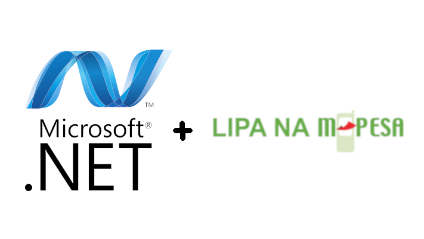

# Mpesa.Net 💸
> An Mpesa Library for .Net

[![Nuget Version][nuget-image]][nuget-url]
[![Build Status][travis-image]][travis-url]
[![Downloads Stats][nuget-downloads]][nuget-url]

A Daraja Rest API .Net Library written in C#. Well documented and Unit tested.



## Installation

```sh
dotnet add package Mpesa.Net
```

## Usage example

```c#
ExtraConfig configs = new ExtraConfig
    {
        ShortCode = 600111,
        Initiator = "initiator",
        LNMShortCode = 12345,
        LNMPassWord = "....",
        SecurityCredential = "....",
        CertPath = "~/c-sharp-mpesa-lib/Mpesa/cert.cer"
    };
Api mpesa = new Api(Env.Sandbox, "consumerKey", "consumerSecret", configs);
```

_For more examples and usage, please refer to the [Documentation](https://mureithi.me/Mpesa.Net/)._

## APIs
- [x] OAuth
- [x] AccountBalance
- [x] B2B
- [x] B2C
- [x] C2BSimulate
- [x] C2BRegister
- [x] LipaNaMpesaOnline
- [x] LipaNaMpesaQuery
- [x] ReversalRequest
- [x] TransactionStatus


## Development setup

Assuming you have `dotnet` installed, To setup development environment just clone and get working :)
```sh
git clone https://github.com/geofmureithi/Mpesa.Net
cd Mpesa.Net
dotnet test
```

## Release History

* 0.1.0
    * The first proper release
    * INTRODUCED: `CommandID()` and `IdentityParty()`
    * Added Testing and Comprehensive Documentations
* 0.0.1
    * Work in progress

## Meta

Geoff Mureithi – [@GeoMureithi](https://twitter.com/geomureithi)

Distributed under the Apache-2 license. See ``LICENSE`` for more information.

[https://github.com/geofmureithi](https://github.com/geofmureithi)

## Contributing

1. Fork it (<https://github.com/geofmureithi/Mpesa.Net/fork>)
2. Create your feature branch (`git checkout -b feature/fooBar`)
3. Commit your changes (`git commit -am 'Add some fooBar'`)
4. Push to the branch (`git push origin feature/fooBar`)
5. Create a new Pull Request

<!-- Markdown link & img dfn's -->
[nuget-image]:https://img.shields.io/nuget/v/Mpesa.Net.svg?style=flat-square
[nuget-url]: https://www.nuget.org/packages/Mpesa.Net/
[nuget-downloads]:https://img.shields.io/nuget/dt/Mpesa.Net.svg?style=flat-square
[travis-image]: https://img.shields.io/travis/geofmureithi/Mpesa.Net/master.svg?style=flat-square
[travis-url]: https://travis-ci.org/geofmureithi/Mpesa.Net
[wiki]: https://github.com/geofmureithi/Mpesa.Net/wiki
